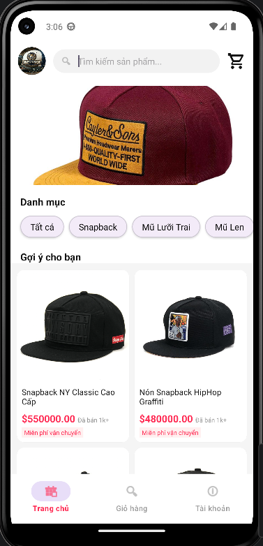
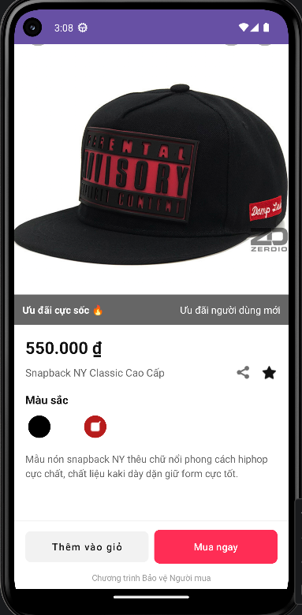

# DOAN_LTMB - Fashion Hat Store Application 🎩

Ứng dụng thương mại điện tử chuyên biệt về các loại nón thời trang (Snapback, Mũ lưỡi trai, Mũ len). Dự án được xây dựng trên nền tảng Android với hiệu năng cao và trải nghiệm người dùng mượt mà.

## 📸 Screenshots

<p align="center">
  
  
</p>

## ✨ Tính năng nổi bật

- **🏠 Trang chủ hiện đại:** Banner quảng cáo tự động chạy (Auto-slide), giao diện lưới sản phẩm chuyên nghiệp.
- **🔍 Tìm kiếm thông minh:** Tìm kiếm sản phẩm theo tên ngay lập tức (Real-time Search).
- **📂 Phân loại sản phẩm:** Lọc sản phẩm nhanh theo danh mục (Snapback, Mũ lưỡi trai, Mũ len).
- **🌈 Biến thể màu sắc động:** Thay đổi hình ảnh sản phẩm lớn ngay khi người dùng chọn các màu sắc khác nhau trong trang chi tiết.
- **🖼️ Trải nghiệm đắm chìm:** Status bar trong suốt giúp hình ảnh sản phẩm hiển thị tràn viền cực đẹp.
- **🛒 Giỏ hàng & Thanh toán:** Quản lý giỏ hàng tập trung và quy trình kiểm tra đơn hàng (Checkout).
- **🔄 Swipe to Refresh:** Cử chỉ vuốt để làm mới dữ liệu nhanh chóng.

## 🛠️ Công nghệ sử dụng

- **Language:** Java 11.
- **ViewBinding:** Kết nối giao diện an toàn và hiệu quả.
- **Glide (v4.16.0):** Tải và xử lý bộ nhớ đệm hình ảnh chuyên sâu.
- **Google Gson:** Xử lý và ánh xạ dữ liệu JSON thông minh.
- **ViewPager2:** Thực hiện tính năng Banner slide mượt mà.
- **Material Design:** Áp dụng ngôn ngữ thiết kế hiện đại của Google.
- **ConstraintLayout & CoordinatorLayout:** Xây dựng bố cục giao diện phức tạp và linh hoạt.

## 📂 Cấu trúc dữ liệu

Ứng dụng quản lý dữ liệu thông qua file `assets/products.json`, cho phép dễ dàng cập nhật và mở rộng lên đến hàng nghìn sản phẩm mà không cần can thiệp sâu vào mã nguồn.

## 🚀 Hướng dẫn cài đặt

1. Clone dự án về máy:
   ```bash
   git clone https://github.com/username/DOAN_LTMB.git
   ```
2. Mở dự án bằng **Android Studio Ladybug** (hoặc phiên bản mới hơn).
3. Chờ Gradle đồng bộ các thư viện (Build -> Clean Project).
4. Chạy ứng dụng trên máy ảo hoặc thiết bị thật (API 32+).

---
**Author:** ADMIN 
**Project:** Đồ án Lập trình di động (DOAN_LTMB)
